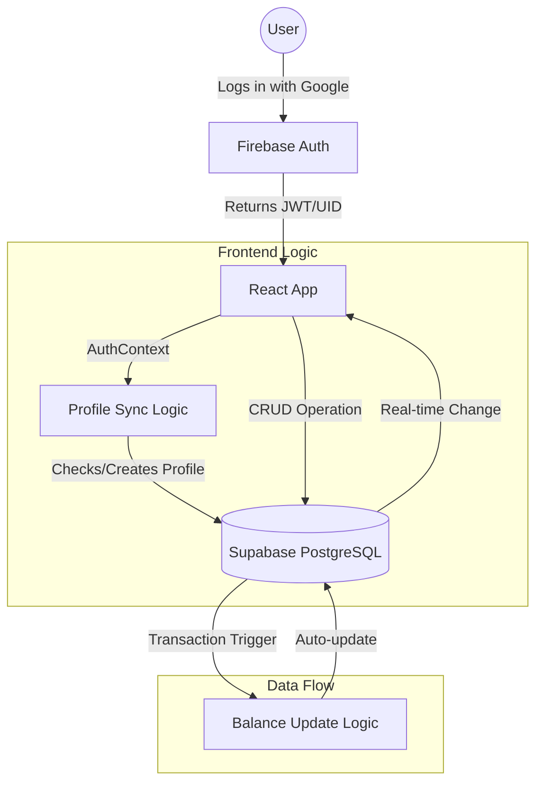

# 🏗️ SpendIQ System Architecture

SpendIQ uses a hybrid-cloud architecture that leverages two separate Backend-as-a-Service (BaaS) providers to achieve a seamless, professional experience: **Firebase** for high-speed authentication and **Supabase** for relational data integrity and real-time triggers.

## 1. High-Level Logic Flow

The following diagram illustrates how a user request flows through the system, from initial authentication to real-time database updates.

---

## 2. The Auth Bridge (Firebase ↔ Supabase)

One of the most critical parts of SpendIQ is the **Identity Sync**. 

- **Why Firebase?** Firebase provides superior social login providers (Google, Apple) and a more mature client-side session management.
- **Why Supabase?** Relational data (Postgres) is essential for financial tracking where one transaction must update a wallet balance.

### **The Sync Mechanism**
The `AuthContext.tsx` acts as the bridge. On every authentication state change:
1.  Firebase provides the `UID`.
2.  The app checks the `profiles` table in Supabase for that `UID`.
3.  If it doesn't exist (new user), it automatically inserts a new profile row using data from the Firebase ID Token (email, display name).
4.  This ensures that every data point in Supabase is strictly tied to a valid Firebase identity.

---

## 3. Real-time Financial Integrity

Financial accuracy is maintained through **Database Triggers** rather than client-side calculations. This prevents "race conditions" where two transactions added simultaneously might overwrite each other's balance updates.

### **The Balance Update Cycle**
- **Trigger**: `on_transaction_created`
- **Logic**: When a row is inserted into `transactions`, a Postgres function `handle_new_transaction()` automatically increments or decrements the associated `wallets.balance`.
- **Consistency**: This ensures the wallet balance is always "The Source of Truth," even if the UI hasn't finished reloading.

---

## 4. UI/UX: Deep Midnight Design System

SpendIQ follows a **Glassmorphism** design language. 

- **Backdrop Filters**: Heavy use of `blur(12px)` for a frosted-glass feel.
- **Color Contrast**: High-saturation neons against a `slate-950` (Deep Midnight) background.
- **Motion**: Every page transition is wrapped in `framer-motion` for a "fluid" app-like feel on mobile and desktop.

---
[Return to Index](./README.md)
